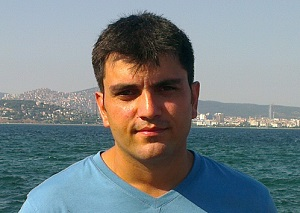
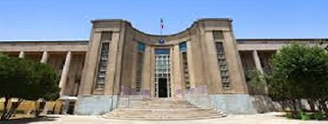
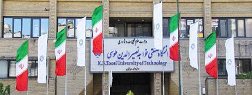

 

# Majid Farahani

3405 North West Orchard Ave., Corvallis, Oregon 97330

(469)386-1812

hosseinm@oregonstate.edu

# Summary
> **“No water, no life. No blue, no green.** ~ _Sylvia Earle

GIS (**_Geospatial Information Systems_**) experts and professional surveyor with more than 9 years of real-world experience in surveying  (route,  industrial,  land and  urban), mapping and geographical  information  system  design  and  implementation.
His  professional  career includes large-scale surveying projects in the areas of transportation (route  design  and  mapping),  urban  and  built  environment,  precise  leveling, topographical,  energy (oil, gas and electricity)  pipelines,  refinery and power plant,  construction as-built, tank volumetric Calibration, deformation analysis mapping with a firm grasp and deep knowledge about modern technologies in satellite positioning systems (like GPS and GLONASS) and GIS software.
Able to find quick and effective solutions for geospatial problems by using creativity, skills, and experience.

## Educations

### Oregon State University (Oregon, USA):us:

[**Civil Engineering and Water Resources Research Lab**](http://research.engr.oregonstate.edu/hydroinformatics/current-members)

**_Graduate Research Assistant_**   (Sep 2017 - present)

Summary of the roles:
* Web Based Visualization
* Water data acquisition and processing
  * GPS
  * total station
  * Terrestrial Laser Scanner (lidar)
* Multi desiplinary Optimization

##### [Civil Engineering Department](http://cce.oregonstate.edu/)

### Tehran University (Tehran, Iran)

 [**Thehran University, Geomatics Department of Engineering**](http://geospatialeng.ut.ac.ir/en/home)
**_M.Sc., GIS and Geomatics Engineering_** (2008 - 2010):mortar_board:

### K.N.Toosi University of Technology(Tehran, Iran)

[**Civil and Geomatics Department of Engineering**](http://www.kntu.ac.ir/Index.aspx?tempname=NewENKntu&lang=2&sub=0)
**_Bachelor Degree, Geomatics Engineering_** (2004 - 2008):mortar_board:

### Skills
        Softwares  | programing skills
      ------------ | -------------
        Arc GIS    |  JavaScripts
        Civil3D    |  Python

# Professional Industry Experiences:

###	Senior Surveying Engineer and GIS expert - Sepehr Geomatic Company
##### Main projects:
 1.  Sepehr1 Residential Building Construction”, 2014
 2. Topographical map production for Zanjan university of medical sciences”, 2012
 3. Conceptual spatial data Modeling, Data Integration and Map production for Kermanshah Regional Water Department , 2011
 4. ArcGIS Software, AutoCAD Civil 3D and AutoCAD Land Development software instructor for Employees of Kermanshah Regional Water Department , 2011
 5. Cadastral Mapping of Tehran (1:200)” , 2011
 6. GIS Software Developer for Kermanshah Jamishan’s dam”, 2011
 7. Integration of  Gas Network Map and Urban Map (1:200)”, 2009
 8. Updating of Tehran Gas Distributing Network data”, 2009

###	Senior Surveying Engineer and GIS expert – Telecommunication Infrastructure Company
##### Main projects:
1. Collecting data and preparation of Optical Fiber Information of Tehran Using RTK-GPS technology”, 2014
2. Design and Development of GIS Software”, 2013

###	Surveying Engineer – OMRAB Engineering Company
##### Company’s profile:
* OMRAB Engineering Company is a licensed and private Consulting engineering company involved in projects related to the Energy, Water-Environment and infrastructure
##### Main projects:
1. Plan-Profile sheet preparation of Iraq Power line”, 2014
2. 63 kw Power line Route Design of Kurdistan-Iraq”, 2014

###	Surveying Engineer, Tehran Construction Engineering Organization, 2012-present

###	Senior Surveying Engineer - Rahyab Niroo Sadr Company
##### Company’s profile:
* GPS Consulting Engineers Co. Rahyab Niroo Sadr is a licensed private Consulting company involved in surveying engineering. The company has accomplished major projects in Iraq, Sudan and Syria.
##### Main projects:
1. Plan-Profile sheet preparation of Gotvand Power line”,2008
2. Plan-Profile sheet preparation of Asalooye Power line”, 2007
3. Plan-Profile sheet preparation of Power line between Tikmedash and Gharechaman”, 2007
4. Plan-Profile sheet preparation of Boinzahra Power line”, 2007
5. Plan-Profile sheet preparation of Zanjan Power line”, 2007
6. Design and Execution of Mapping Power Pipeline between Sormagh and Fasa”, 2006

###	Surveying Engineer and Supervisor – Iran International General Constructor Company (IGC)
##### Company’s profile:
* Iran International General Contractor Company (IGC) since its foundation in 1991, has been engaged in engineering, procurement, project management and construction services for oil refineries, petrochemical plants, oil storage tanks, pipelines, and general engineering markets and all other industrial projects related to oil, gas and petrochemical industries of Iran, in strict accordance to international standards, and intends to utilize internal resources and potentials and prepare the ground for maximizing Iranian content of projects.
##### Main projects:
1. Surveying and Mapping of the Gas Pipeline of Asalooyeh and Siri”, 2012
2. Surveying supervision of Gas Compressor site of Saveh”, 2011

###	Surveying Engineer and Supervisor – Signal Consulting Engineers Company
##### Company’s profile:
* Signal Consulting Engineers Company was founded in 1974. is a licensed and private Consulting engineers company involving in technological and scientific progress and offer topographic maps and data in according to the codes set by the Management and Planning Organization.
##### Main projects:
1. Road Map Updating of Kermanshah province with the IRS and Spot Satellite Image”, 2012.
2. Kermanshah City Map Updating with the Quick bird Satellite Image”, 2011.
3. Updating of the Statistical maps of the KERMANSHAH Province and GIS Ready Data Map”, 2010.

###	Surveying Engineer and Supervisor – Nano Meghyas Modern Company
##### Main projects:
1. Route Surveying of Shirvan City”, 2013

###	Surveying Engineer and Supervisor – Hafkan Company
##### Main projects:
1.  Topographic Mapping  of Zanjan Medical University”, 2009

###	Surveying Engineer and Supervisor – FAM Zirsakht Company
##### Main projects:
1. GIS for Kermanshah Local Government”, 2010

> If you need more information, do not hesitate to send email me:

